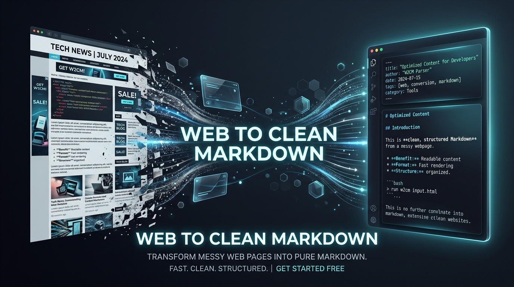

<p align="center">
  
</p>

# Web to Clean Markdown & Study Archiver for LLM

<p align="center">
  <strong>1-Click convert web articles, exam sheets & technical documentation into clean Markdown, plus a built-in Local Study Archiver Vault for ChatGPT, Claude, Gemini, and Obsidian.</strong>
</p>

<p align="center">
  <a href="README.md"><b>English</b></a> •
  <a href="README_VN.md"><b>Tiếng Việt</b></a> •
  <a href="README_CN.md"><b>简体中文</b></a>
</p>

<p align="center">
  <a href="LICENSE"></a>
  <a href="manifest.json"></a>
  <a href="PRIVACY.md"></a>
  <a href="https://github.com/devnhancook/web-to-clean-markdown/stargazers"></a>
</p>

---

## 🌟 Why Web to Clean Markdown & Study Vault?

When studying, doing research, or collecting past exam solutions from modern websites, **over 60% of the page is visual clutter** (ads, cookie banners, navigation menus, popups). Copy-pasting directly into LLMs wastes valuable context tokens and breaks formatting.

**Web to Clean Markdown** combines an ultra-fast **Clipper (<200ms)** and a **Built-in Local Study Vault** directly in your browser.

---

## ✨ Key Features

- **🚀 1-Click "Copy for LLM"**: Instantly copies formatted Markdown with full YAML frontmatter (`title`, `author`, `source_url`, `clipped_at`, `reading_time`) to your clipboard.
- **📚 Local Study Vault (Archiver)**: Save articles and study sheets directly into your browser's private vault with subject tags (`Toán`, `Lý`, `Hóa`, `Văn`, `English`, `Tech`).
- **🔍 Instant Search & Reader View**: Filter by subjects, search keywords, and preview full documents inside a clean reader modal.
- **📦 "Download .md" & Bulk Backup**: Save individual `.md` files or export your entire study vault as JSON.
- **🎯 Smart Visual Selector**: Hover and click on any specific DOM container to clip only that segment (e.g. formula block or comment thread).
- **🛡️ 100% Local & Privacy-First**: Operates entirely client-side. Zero telemetry, zero analytics, no external servers.
- **⌨️ Keyboard Shortcut**: Press `Ctrl+Shift+K` (or `Cmd+Shift+K` on Mac) for instant 1-click clipping.

---

## 🚀 Installation Guide (Developer / Load Unpacked)

1. Clone or download this repository:
   ```bash
   git clone https://github.com/devnhancook/web-to-clean-markdown.git
   ```
2. Open your browser extensions page:
   - Chrome: `chrome://extensions`
   - Edge: `edge://extensions`
   - Brave: `brave://extensions`
3. Enable **Developer mode** in the top right.
4. Click **Load unpacked** and select the `web-to-clean-markdown` folder.

---

## ⭐ Star & Feedback

If this extension saves you time in your daily workflow or exam preparation, please give this repository a **Star ⭐ on GitHub** and share it with classmates!

- 🐛 [Report a bug or feature request](https://github.com/devnhancook/web-to-clean-markdown/issues)
- 👤 Follow [@devnhancook](https://github.com/devnhancook) on GitHub

---

## 📄 License

Distributed under the [MIT License](LICENSE). Built with ❤️ by [@devnhancook](https://github.com/devnhancook).
